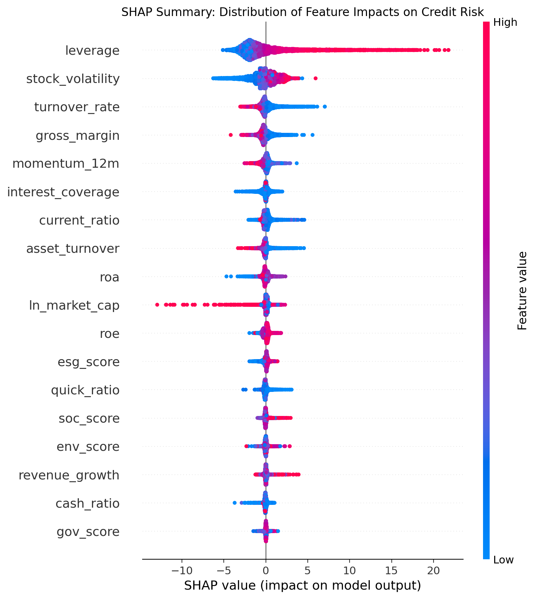
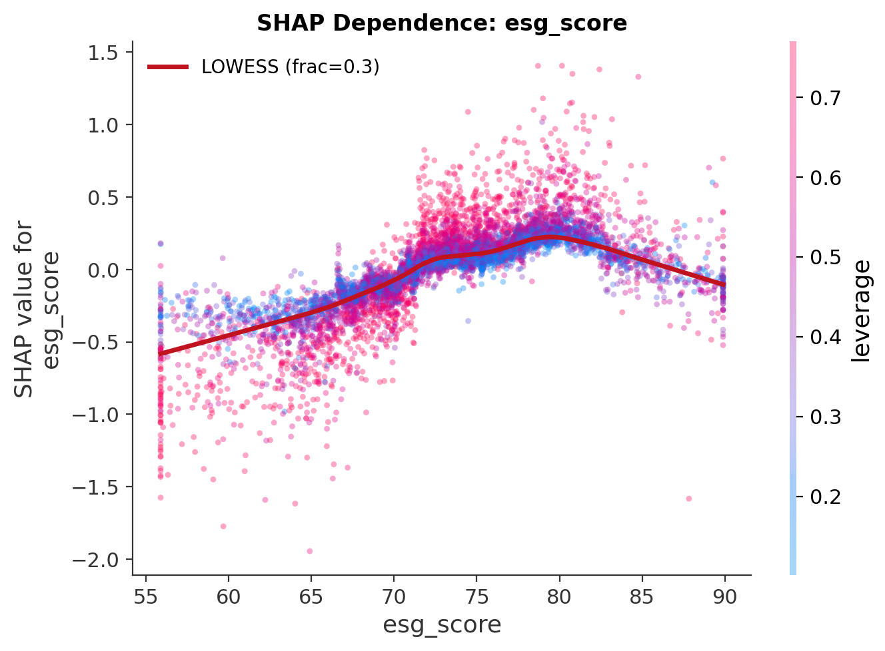

# ESG-Augmented Corporate Credit Risk Prediction & Explainability

An end-to-end machine learning pipeline that predicts corporate credit risk for Chinese A-share listed firms from **18 firm-level features** (financial ratios, market indicators, and ESG scores) and explains the model through a **four-layer SHAP analysis**. Built on a real firm-year panel of **42,108 observations across 5,423 firms (2015-2025)**.

The central research question: *beyond traditional financial and market signals, do ESG scores carry incremental information about corporate credit risk, and how does that effect behave across firms and across different risk definitions?*

## Data

The panel is assembled from licensed **CSMAR** and **Huazheng ESG** data. Because these sources cannot be redistributed, the raw vendor files are **not** included in this repository. The full ingestion code (`src/ingest/`) and a field-level data dictionary ([`data/README.md`](data/README.md)) let anyone with CSMAR access rebuild the exact panel. A synthetic sample generator (`src/data_generator.py`) is retained so the modelling code can be smoke-tested without the licensed data.

Raw sources (standard vendor exports):

| Table | Provides |
|---|---|
| `FS_Combas` balance sheet | 7 balance-sheet items -> leverage, liquidity ratios |
| `FS_Comins` income statement | revenue, cost, interest, profit -> profitability, coverage, EBIT |
| `TRD_Mnth` monthly return / market value | ln(market cap), 12-month momentum |
| `LIQ_TOVER_M` monthly turnover | annual turnover rate |
| `TRD_Dalyr` daily return | annualised volatility |
| `BDT_FinDistMertonDD` | distance-to-default (KMV / Merton / Bharath-Shumway) + ST/*ST flag |
| Huazheng ESG | composite + E/S/G pillar scores |

Sample construction (transparent, reproducible filters in `src/ingest/build_panel.py`): consolidated annual statements only -> drop financial industry -> drop contemporaneous ST/*ST firm-years -> restrict to 2015-2025 -> require a valid distance-to-default. Continuous variables are winsorized at the 1st/99th percentiles.

## The credit risk target: why not a Z-score

A tempting target is the Altman Z''-score. It is avoided here deliberately: the Z-score is itself a linear combination of financial ratios that overlap with the feature set, so predicting it produces an inflated fit and, critically, leaves **no room for ESG to show incremental value** because the target contains no information ESG could add.

Instead the primary target is the **Merton/KMV distance-to-default (DD)**, whose information comes largely from *market* pricing of equity (price, volatility, leverage) rather than accounting identities. DD is inverted into a continuous risk score (higher = riskier). Two independent robustness targets are also used: alternative DD definitions (Merton, Bharath-Shumway) and a forward-looking **ST/*ST distress event in year t+1**.

## Pipeline

```
raw CSMAR/ESG tables --> build_panel --> winsorize --> sklearn Pipeline --> RandomizedSearchCV --> XGBoostXAIAnalyzer
                        (18 features)   (1%/99%)     [median impute        28 candidates          4-layer SHAP
                                                      + XGBRegressor]       x 5-fold CV
```

- **Model**: XGBoost regression in a `sklearn.Pipeline`; median imputation is fit inside CV folds only, so no leakage.
- **Tuning**: `RandomizedSearchCV`, 28 sampled configurations x 5-fold CV (140 fits) over 8 hyperparameters.
- **Explainability**: an object-oriented `XGBoostXAIAnalyzer` encapsulating the full SHAP workflow.

### Headline results (real panel)

| | Value |
|---|---|
| Test R-squared (distance-to-default regression) | **0.683** |
| Test RMSE / MAE | 3.61 / 1.94 |
| Distress classification ROC-AUC (predict ST/*ST next year) | **0.923** |

Top features by mean(\|SHAP\|): `leverage` > `stock_volatility` > `turnover_rate` > `gross_margin` > `momentum_12m`. ESG features rank lower individually, which is exactly why the incremental-value question below matters.

## Does ESG add value? (the core finding)

The ESG effect is tested by **ablation**: a baseline model (14 financial + market features) versus the full model (+ 4 ESG features), both evaluated with **firm-grouped cross-validation** (`GroupKFold`) so no firm ever spans train and test, the correct guard for panel data.

**Regression (distance-to-default):**

| Model | Features | R-squared | RMSE |
|---|---|---|---|
| Baseline | 14 | 0.6372 | 3.830 |
| + ESG | 18 | 0.6461 | 3.783 |

ESG reduces RMSE by 1.25%, and the improvement is **statistically significant** across folds (paired t-test, t = 6.45, p = 0.003).

**The effect replicates on independent targets and definitions:**

| Target | Baseline | + ESG | ESG gain |
|---|---|---|---|
| DD (KMV) R-squared | 0.637 | 0.646 | +0.009 |
| DD (Merton) R-squared | 0.725 | 0.737 | +0.011 |
| DD (Bharath-Shumway) R-squared | 0.764 | 0.778 | +0.014 |
| Distress ROC-AUC | 0.915 | 0.923 | +0.008 |

The incremental value of ESG is small but **positive and consistent** across three distance-to-default algorithms and a separate forward-looking distress-classification task. This is a deliberately honest effect size (modest, robust, defensible) rather than the inflated result a leaky target would produce.

## Four-layer SHAP analysis

| Layer | Method | Output |
|---|---|---|
| 1. Global importance | Beeswarm + mean(\|SHAP\|) bar chart | `figures/shap_summary_beeswarm.png`, `shap_importance_bar.png` |
| 2. Dependence | SHAP dependence plots with **LOWESS smoothing** | `figures/shap_dependence_*.png` |
| 3. Interactions | SHAP interaction-value matrix (heatmap) + targeted plots | `figures/shap_interaction_heatmap.png` |
| 4. Individual level | Force + waterfall plots per firm-year | `figures/shap_force_obs_*.png`, `shap_waterfall_obs_*.png` |



Leverage and equity volatility dominate the distance-to-default prediction, consistent with the structural credit-risk intuition behind the Merton model. The ESG dependence layer shows a mild risk-reducing gradient in higher-scoring firms:



## Quickstart

```bash
git clone https://github.com/<user>/esg-credit-risk-xai.git
cd esg-credit-risk-xai
pip install -r requirements.txt
```

**With real data** (CSMAR access required, see [`data/README.md`](data/README.md)): place the raw exports under `data/raw/`, then

```bash
python -m src.ingest.build_panel --raw data/raw --out data/panel_real.csv
python run.py                                   # tune + evaluate + SHAP figures
python -m src.evaluation.ablation               # ESG incremental-value test
python -m src.evaluation.distress_classification
python -m src.evaluation.robustness
```

**Without real data** (smoke test on synthetic sample):

```bash
python -m src.data_generator          # writes data/sample_synthetic.csv
# point config.yaml:data.path at the synthetic file, then:
python run.py
```

The tuning runs serially by default (`n_jobs=1`) so it stays within a small RAM budget; raise `n_jobs` in `src/model.py` if you have headroom.

### Using the analyzer directly

```python
from src.xai_analyzer import XGBoostXAIAnalyzer

analyzer = XGBoostXAIAnalyzer(fitted_pipeline, X_test, output_dir="figures")
analyzer.global_importance()                       # layer 1
analyzer.dependence(["esg_score", "leverage"])     # layer 2 (with LOWESS)
analyzer.interaction_matrix()                      # layer 3
analyzer.explain_instance(0)                       # layer 4
```

## Repository structure

```
esg-credit-risk-xai/
  run.py                        # tune + evaluate + SHAP
  config.yaml                   # features, CV settings, search space, seed
  requirements.txt
  src/
    ingest/
      schema.py                 # raw field -> English name mapping (single source of truth)
      build_panel.py            # assemble firm-year panel from raw tables
    data_prep.py                # winsorization, loading, splitting
    model.py                    # Pipeline + RandomizedSearchCV
    xai_analyzer.py             # XGBoostXAIAnalyzer (4-layer SHAP)
    data_generator.py           # synthetic sample (smoke test only)
    evaluation/
      ablation.py               # baseline vs +ESG, grouped CV + significance
      distress_classification.py  # predict ST/*ST next year (AUC)
      robustness.py             # ESG effect across DD definitions
  data/
    README.md                   # CSMAR/ESG field dictionary and reconstruction
    sample_synthetic.csv        # generated on demand
  figures/                      # SHAP outputs
  outputs/                      # metrics.json, ablation.json, robustness.json, ...
```

## Design notes

- **Leakage control on two fronts**: imputation lives inside the Pipeline (refit per CV fold); firm-grouped CV keeps any firm from spanning train and test.
- **Honest target choice**: distance-to-default over Z-score, so ESG has genuine room to add information.
- **Multi-target validation**: the ESG finding is checked against three DD algorithms and an independent forward-looking distress event, not a single specification.
- **Determinism**: a single seed controls the split, the hyperparameter sampler, and SHAP subsampling.
- **Scope of the finding**: results apply to non-financial A-share firms with available ESG coverage; the ESG effect is modest in magnitude.

## License

MIT
